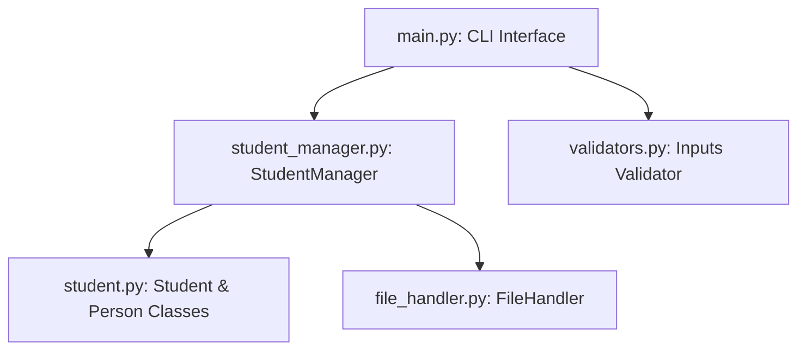

# Project Report: Student Management System

## 1. Cover Page
*   **Project Title**: Modular Student Management System
*   **Course Code**: CS-301 Object-Oriented Software Engineering
*   **Academic Year**: 2026-2027
*   **Submitted By**: College Project Student
*   **Institution**: Department of Computer Science & Engineering

---

## 2. Certificate / Declaration
I hereby declare that this project report entitled **"Student Management System"** is an authentic work carried out by me as a course project requirement. All code modules, designs, and implementations are self-made, adhering to Object-Oriented principles and programming guidelines.

---

## 3. Acknowledgement
I express my deep gratitude to our course instructor and laboratory assistants for their continuous guidance, support, and constructive feedback throughout the development cycle of this project.

---

## 4. Abstract
This project presents a console-based **Student Management System (SMS)** built in Python. The system manages student profile information, offering CRUD, search, filter, and validation capabilities. It stores data persistently using JSON, implements a multi-module architecture, and encapsulates logic using Object-Oriented Programming (OOP) paradigms (Inheritance, Encapsulation, Abstraction, Polymorphism).

---

## 5. Introduction
A Student Management System is a critical software utility for managing academic and personal profiles. This system replaces manual paper logs, ensuring fast query operations and structured record updates.

---

## 6. Problem Statement
Manual student registration systems suffer from data redundancy, formatting errors, slow query speeds, and complete lack of security or structure. An automated solution is required to clean, validate, store, and manipulate data programmatically.

---

## 7. Objectives
*   Implement custom data validation modules to clean inputs.
*   Enforce OOP architectures (inheritance, encapsulation, and abstractions).
*   Implement data persistence using standard text formatting (JSON files).
*   Create a clean, crash-proof menu-driven application interface.

---

## 8. Scope of the Project
This terminal-based application serves as a prototype database engine suitable for departments, labs, and registrar desks. It allows fast filtering and searching without needing cloud server setup.

---

## 9. Technologies Used
*   **Programming Language**: Python 3.8+
*   **Storage Framework**: JSON Files
*   **Testing Suite**: Python `unittest` framework

---

## 10. System Requirements
### Software Requirements
*   Operating System: Windows, macOS, or Linux
*   Runtime Engine: Python 3.8 or above
*   Text Editor: VS Code, PyCharm, or equivalent

### Hardware Requirements
*   Memory (RAM): 2 GB Minimum
*   Disk Space: 50 MB Free Space
*   Processor: Dual Core CPU or above

---

## 11. System Design
The system uses a layered model separation:

---

## 12. Architecture
1.  **Presentation Layer (`main.py`)**: Gathers and validates CLI inputs, displays menus.
2.  **Domain/Model Layer (`student.py`)**: Stores profile schemas (`Person` & `Student`).
3.  **Controller Layer (`student_manager.py`)**: Executes search, filtering, and dictionary mapping.
4.  **Data Access Layer (`file_handler.py`)**: Loads/saves JSON structures on disk.

---

## 13. Module Description
*   [`validators.py`](file:///C:/Users/vvats/student-management-system/validators.py): Matches pattern expressions (regex) for phone, email, grades, and age bounds.
*   [`student.py`](file:///C:/Users/vvats/student-management-system/student.py): Holds OOP constructs. Overrides standard constructor logic and serialization rules.
*   [`file_handler.py`](file:///C:/Users/vvats/student-management-system/file_handler.py): Reads and handles OS level errors, missing files, or corrupted JSON formats.
*   [`student_manager.py`](file:///C:/Users/vvats/student-management-system/student_manager.py): Runs filtering operations and CRUD loops.

---

## 14. OOP Concepts Applied
*   **Classes and Objects**: Representing students.
*   **Inheritance**: `Student` inherits `name`, `age`, `email`, `phone`, and `address` parameters from the `Person` base class.
*   **Encapsulation**: Validations are executed within the constructor; direct variable mutations are disallowed.
*   **Abstraction**: Reading/writing detail queries are encapsulated inside class methods.

---

## 15. File Handling
JSON serialization is performed via `json.dump` and parsed back using `json.load`. File IO checks guarantee that invalid syntax or permissions issues do not crash the runtime engine.

---

## 16. Exception Handling
Custom error handling blocks (`try-except`) are implemented across:
- Input constraints (ValueError raised by regex rules).
- Duplicate ID validation.
- File integrity checks (JSONDecodeError, PermissionError).

---

## 17. CRUD Operations
*   **Create**: Adds and saves non-duplicate records.
*   **Read**: Displays tabular grids.
*   **Update**: Updates changed fields while preserving others.
*   **Delete**: Removes record with confirmation.

---

## 18. Search and Filter Implementation
*   **Search**: Evaluates ID matches or checks substring pattern matches on Names, Courses, and Branches.
*   **Filter**: Processes queries concurrently over branch, course, semester, and CGPA ranges.

---

## 19. Testing
Nine test cases are written in `test_system.py` covering:
*   Duplicate ID error generation.
*   Formatting validators for email and CGPA ranges.
*   CRUD operations check.
*   Corrupted file safety check.

---

## 20. Sample Outputs / Screenshots Placeholders
*See project demonstration output in terminal during runs.*

---

## 21. Advantages
*   No external database configurations required.
*   Modular structure makes it easy to maintain and expand.
*   Real-time validations prevent corrupted data entry.

---

## 22. Limitations
*   Console interface lacks graphical visualization.
*   No multi-user authentication layer.

---

## 23. Future Enhancements
*   Add graphical GUI (Tkinter or PyQt).
*   Add password authentication rules.
*   Migrate disk files to an SQL database.

---

## 24. Conclusion
The Modular Student Management System successfully demonstrates practical software development standards. By keeping separation of concerns, the code remains clean, readable, and ready for extension.

---

## 25. References
1. Python Documentation on Standard Libraries (https://docs.python.org/3/)
2. *Object-Oriented Programming in Python*, Goldwasser & Letscher.
